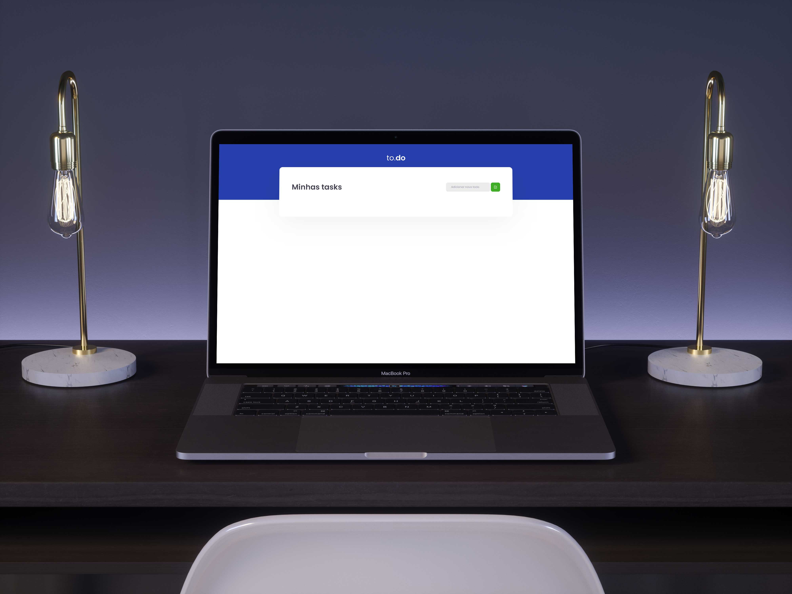

  <a href="#-tecnologias">Tecnologias</a>&nbsp;&nbsp;&nbsp;|&nbsp;&nbsp;&nbsp;
  <a href="#-projeto">Projeto</a>&nbsp;&nbsp;&nbsp;|&nbsp;&nbsp;&nbsp;
  <a href="#memo-licença">Licença</a>

 

  

 

  

## 🚀 Tecnologias

Esse projeto foi desenvolvido com as seguintes tecnologias:

- [React](https://pt-br.reactjs.org)
- [TypeScript](https://www.typescriptlang.org/)

## 💻 Projeto

Esse projeto foi desenvolvido durante o curso **[Ignite](https://rocketseat.com.br/)** da **[Rocketseat](https://www.linkedin.com/school/rocketseat/about/)**
O To Do list é uma aplicação onde você cria seus compromissos ou tarefas que ira realizar e ir marcando quando termina-las

## 👨🏾‍💻 Como rodar o projeto
Para rodar o projeto basta executar o comando
### `yarn dev`
ou
### `npm run dev`
que o projeto vai rodar em [http://localhost:8080](http://localhost:8080)

## :memo: Licença

Esse projeto está sob a licença MIT. Veja o arquivo [LICENSE](LICENSE.md) para mais detalhes.

Este projeto foi desenvolvido com ❤️ por **[@John Everton](https://www.linkedin.com/in/john-everton01/)**, com o instrutor **[@Diego3g](https://github.com/diego3g)** 💜.  
Se isso te ajudou, dê uma ⭐, isso vai me ajudar também! 😉

